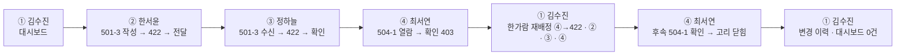

# 07. 시연 시나리오 — 너와나의인계고리 데모

> 대상: 발표(1인 5분) 중 **데모 구간**. 전체 대본은 약 3분, 짧은 판은 90초.
> 실행: `demo/index.html` 을 브라우저로 연다(서버 불필요). 시작 전 **데모 초기화** 두 번 클릭 → 시드 복원.
> **모든 인물·입원 건은 가상.** 병동 1곳(5병동) · A팀(501~503호) · B팀(504~506호) · 데모 시계 2026-09-16 21:30 고정.

---

## 0. 등장인물과 시작 상태

| 사용자 | 역할 | 데모에서 하는 일 |
|---|---|---|
| **김수진** | 수간호사 | 대시보드 · 배정 · 결원 재배정 · 변경 이력 |
| **한서윤** | A팀 차지 · 9/16 E (14~22시) | 인계 **작성·전달** |
| **정하늘** | A팀 차지 · 9/16 N (22~08시) | 인계 **수신·요약·확인** |
| **최서연** | B팀 · 9/16 N · 역할 미배정 | 같은 팀 **열람만** → 대체자가 되어 후속 인계 확인 |
| **한가람** | B팀 차지 · 9/16 N · **결원(ABSENT)** | 재배정 대상 (화면에 등장만) |

시드가 만들어 둔 상태:

```
미확인 인계 2건   501-1 (한서윤 → 정하늘 · SENT)  ·  504-1 (서지호 → 한가람 · SENT)
작성 중 1건       501-3 (한서윤 → 정하늘 · DRAFT · 필수 항목 2개 비어 있음)
대체 전 결원 1건  한가람 9/16 N (20:40 등록 · 사유 "당일 병가" · 504-1 · 504-3 담당)
과거 사례         9/15 박영숙 결원 → 정하늘 대체 · 502-2 인계 SUPERSEDED + 후속 CONFIRMED
```

---

## 1. 흐름 한눈에



관통하는 문장: **"누가 인계를 맡았고, 누가 받아 확인했는지"** 가 사람이 바뀌어도(결원) 끊기지 않는다.

---

## 2. 대본 (약 3분)

각 단계는 `사용자 → 화면 → 누르는 것 → 보이는 것 → 한 마디` 순서. 상태코드는 화면 우하단 **API 알약**에 찍힌다.

### ① 김수진 — 병동 대시보드 (20초)

- 로그인 화면에서 **김수진** 카드 클릭
- 보이는 것: 오늘 근무자 9명 · **미확인 인계 2건** · **대체 전 결원 1건(한가람)**
- 한 마디: *"수간호사는 두 숫자만 봅니다. 아직 확인 안 된 인계, 아직 못 메운 결원."*
- 짚을 점: 타일에 "인계 미작성 N건"이 **없다** — EMR 연동이 없어 "썼어야 하는데 안 쓴 건"은 셀 수 없기 때문

### ② 한서윤 — 인계 작성·전달 (40초)

- 사용자 전환 → **한서윤** → 내 근무 화면
- 보이는 것: 우리 팀 환자 4건, 각 행에 **인계 담당** 표시 · 두 열 — **받은 인계(앞 근무 → 나)** 와 **보낸 인계(나 → 다음 근무)** · 501-3 은 보낸 인계가 **임시저장(DRAFT)**
- 한 마디: *"왼쪽은 내가 받아 확인한 것, 오른쪽은 내가 다음 근무에 넘길 것. 한 화면에 두 방향이 다 보입니다."*
- **작성 계속** 클릭 → 인계 작성 화면 → 바로 **인계 넘기기** 클릭
- 결과: **`422 REQUIRED_ITEMS_EMPTY`** — "필수 항목 2개가 비어 있습니다" 빨간 박스 · 비어 있는 항목명 표시
- 한 마디: *"병동 공통 필수 항목이 비면 넘길 수 없습니다. 항목은 수간호사가 정하고, 인계마다 스냅샷으로 복사됩니다."*
- 빈 두 칸 채움 → **인계 넘기기** → **SENT** · "정하늘 간호사에게 전달되었습니다"
- 짚을 점: 받는 사람은 **서버가 골랐다**(같은 입원 건의 다음 근무 담당). 요청에서 받지 않는다

### ③ 정하늘 — 수신·요약·확인 (40초)

- 사용자 전환 → **정하늘** → 501-3 행 **인계 확인** 클릭
- 화면 진입 자체가 열람 기록(`POST …/receipt` · received_at). GET 에 부작용을 두지 않으려고 분리
- 요약 없이 **확인 처리** 클릭 → **`422 SUMMARY_REQUIRED`**
- 한 마디: *"읽었다는 클릭이 아니라, 자기 말로 요약해야 확인입니다. I-PASS 의 read-back."*
- 요약 한 줄 입력 → **확인 처리** → **CONFIRMED** · 확인 시각 기록
- 짚을 점: 대시보드로 돌아가면 미확인 건수가 **2 → 1**

### ④ 최서연 — 같은 팀은 열람만 (20초)

- 사용자 전환 → **최서연**(B팀 · 9/16 N · 역할 미배정)
- 보이는 것: 504-1 **확인 대기** · 버튼은 **받은 인계 보기**(확인 버튼 아님)
- 열어서 요약 입력 후 **확인 처리** → **`403 NOT_RECEIVER`**
- 한 마디: *"같은 팀·같은 근무라 읽을 수는 있습니다. 확인은 담당(한가람)만. 그런데 한가람은 결원입니다."*

### ⑤ 김수진 — 결원 재배정 4단계 (50초)

- 사용자 전환 → **김수진** → 대시보드 결원 행 **재배정** 클릭
- 4단계 카드: ① 결원 등록(완료·20:40) · ② 대체자 배정 · ③ 인계 담당 이관 · ④ 대체 완료로 확인
- 먼저 **④ 대체 완료로 확인** 클릭 → **`422 NO_VALID_SUBSTITUTE`**
  - 한 마디: *"대체자 없이 '완료'라고 적을 수 없습니다. 완료는 자동 판정이 아니라 사람의 확인 기록이지만, 근거 없는 확인은 막습니다."*
- ② 대체자 **최서연** 선택 → **대체자 배정** → 배정됨 · 사유는 ①에서 **복사**
- ③ 잔여 담당 2건(504-1 확인 대기 · 504-3 인계 없음) 체크된 채 **이관** →
  결과 박스: *"인계 #8 → SUPERSEDED, 후속 #9 발행 · 504-3 은 담당만 이관"*
  - 한 마디: *"원본 인계는 지우지 않고 SUPERSEDED 로 보존, 새 수신자에게 후속 인계를 같은 트랜잭션에서 발행합니다."*
- ④ **대체 완료로 확인** → covered_at 기록 · 대시보드 결원 **0건**

### ⑥ 최서연 — 고리가 닫힌다 (20초)

- 사용자 전환 → **최서연** → 504-1 에 **인계 담당** 표시 + **인계 확인** 버튼 + "결원 재배정 이력 있음"
- 요약 입력 → **확인 처리** → **CONFIRMED**
- 한 마디: *"결원이 났어도 '누가 받아 확인했는지'가 끊기지 않았습니다. 이게 고리입니다."*

### ⑦ 김수진 — 변경 이력 (10초)

- **변경 이력**: 결원 등록 → 대체자 배정 → 담당 이관 ×2 → 대체 완료 확인, 사유 "당일 병가"가 **한 번 입력되고 세 번 복사**됨
- 대시보드: 미확인 1건(504-1 은 후속이 확인됨 → 남은 건 501-1) · 결원 0건

---

## 3. 90초 짧은 판

시간이 밀리면 **②·③·⑤** 만 한다.

| 순서 | 사용자 | 클릭 | 보여줄 상태코드 |
|---|---|---|---|
| 1 | 한서윤 | 작성 계속 → 인계 넘기기 → 채움 → 넘기기 | 422 → 200 |
| 2 | 정하늘 | 인계 확인 → 확인 처리 → 요약 → 확인 처리 | 422 → 201 |
| 3 | 김수진 | 재배정 → ④ → ② 최서연 → ③ 이관 | 422 → 201 → 200 |

마무리 한 문장: *"버튼 하나가 API 하나, 상태코드 하나, 테이블 행 변화 하나입니다. 설계와 화면이 같은 규칙으로 움직입니다."*

---

## 4. 이 시연이 증명하는 설계 규칙 (질문 대비)

| 화면에서 본 것 | 근거 | 출처 |
|---|---|---|
| 필수 항목 비면 422 | `handover_item.is_required` · DRAFT→SENT 전이 조건 | DBML `handover` note · T6 F-04 |
| 받는 사람을 서버가 고름 | 서버 계산 ⑥ — 같은 입원 건의 시간상 다음 ACTIVE 담당 | T6 F-04 작성 시작 |
| 요약 없이 확인 불가 422 | `handover_receipt.receiver_summary` · read-back | DBML `handover_receipt` note |
| 같은 팀 열람 OK · 확인 403 | 읽기 3단 ③ (`sent_at IS NOT NULL`) vs 수신 당사자 판정 | T3 · T6 GET /handovers/{id} |
| 대체자 없이 완료 422 | 서버 계산 ③ — 유효한 SUBSTITUTE_ASSIGNED 4조건 | T6 F-05 ④ |
| 원본 SUPERSEDED + 후속 발행 | append-only · `superseded_by_handover_id` 불변식 | DBML `handover` note 규칙 1~6 |
| 사유 한 번 입력 · 세 번 복사 | 서버 계산 ④ | T6 F-05 · DBML `reassignment_log` |
| "인계 미작성 N건" 없음 | 예정된 인계·기한의 정의가 없다 | T6 대시보드 절 · `work/인터뷰_1일차_결과.md` §10-3 |

---

## 5. 사고 대비

| 상황 | 대응 |
|---|---|
| 버튼이 기대와 다르게 동작 | 상단 **데모 초기화** 두 번 클릭 → 시드 복원 → 해당 단계부터 다시 |
| 이전 상태가 남아 있음(새로고침 뒤) | 정상 — 상태는 localStorage 에 남는다. 처음부터면 초기화 |
| 화면이 옛 디자인으로 보임 | 브라우저 캐시 — ⌘⇧R |
| 발표 PC 에 브라우저만 있고 서버 없음 | 그대로 됨 — `file://` 로 열린다 |
| 시간이 밀림 | §3 짧은 판으로 전환 |

---

## 6. 캡처와의 대응

기술서에 들어간 `assets/<화면ID>.png` 12장은 **이 대본의 순서로 상태를 만들어** 찍었다(`docs/06` 캡처 현황표).
슬라이드의 그림과 라이브 데모 화면이 같은 상태를 보여준다.
